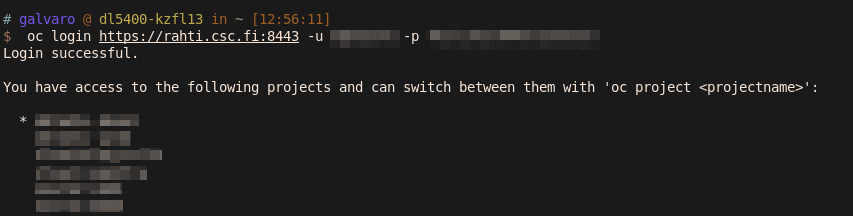
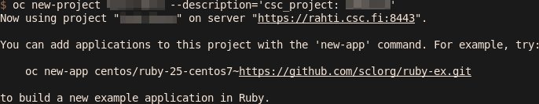
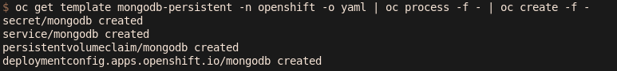
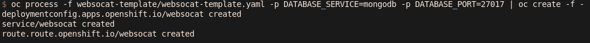
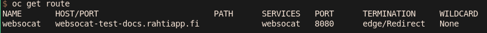

# Launching MongoDB and websocat for end-users

In order to run mongoDB in Rahti and make it available in Puhti (and anywhere else that Rahti), a websocket proxy must me used. The process is the following:

# Using `oc`

`oc` is the command line tool used by OpenShift, it is similar to the tool `kubectl` used by Kubernetes but with added support for the extra features OpenShift provides over Kubernetes. Puhti should have available the `oc` tool, but it is possible to install it in any computer. see the guide on [how to install the oc tool](https://docs.csc.fi/cloud/rahti/usage/cli/#how-to-install-the-oc-tool)

* Login

```
oc login https://rahti.csc.fi:8443 -u <USER> -p <PASSOWRD>
```
**NOTE**: Replace the values between `<>` with your CSC account user and password.



It is also possible to use a TOKEN to login, see the article on [how to login with oc]*https://docs.csc.fi/cloud/rahti/usage/cli/#how-to-login-with-oc)

* Create a OpenShift project/namepace

```
oc new project <NAME> --description='csc_project: <NUMBER>'
```
 **NOTE**: Replace the values between `<>` with the project name, and the CSC project number for billing.



* Launch the mongoDB persistent template

```
oc get template mongodb-persistent -n openshift -o yaml | oc process -f - | oc create -f -
```

This will launch the database using the default parameters. The DB will be available internally to the Rahti project in the DNS mongodb port 27017. In order to see the available parameters and itsw default values, you can run `oc process mongodb-persistent -n openshift --parameters`.



* Launch websocat template

```
git clone https://github.com/lvarin/websocat-template.git
oc process -f websocat-template/websocat-template.yaml -p DATABASE_SERVICE=mongodb -p DATABASE_PORT=27017 | oc create -f -
```

This will launch the websocat proxy. It assumes that the DB was launched using the default parameters.



* Write down URL

```
oc get route
```

The Host can be found under `HOST/PORT`.



* See the username and password of mongodb

The username and password have been generated automatically, the password is 16 random alphanumeric characters long, and the user is the word `user` plus 3 random alphanumeric characters. They are stored in a `secret`:


```
oc get secret/mongodb -o json | jq ' .data."database-password" ' -r | base64 -d
```

```
oc get secret/mongodb -o json | jq ' .data."database-user" ' -r | base64 -d
```


