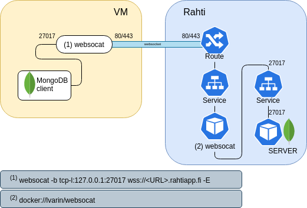

# Websocat server

**THIS IS A BETA TEMPLATE, not supported**

This template deploys a websocket proxy server. This proxy server will run in Kubernetes, and it will create a connection to the service configured to the user. Then it will create a Websocket entrypoint. Any traffic coming to the websocket will relied to the configured service. The following drawing example uses mongoDB as `service`.



This template is written with OpenShift OKD/Rahti in mind, but it should work in any kubernetes with minor modifications.

## Deploy this template

The process has 3 steps:

1. Login into Rahti/Kubernetes, follow the following guides: to [get access to Rahti](https://docs.csc.fi/cloud/rahti/access/) and to [login wirth OC](https://docs.csc.fi/cloud/rahti/usage/cli/#how-to-login-with-oc).

2. Create a namespace, follow the [Creating a project](https://docs.csc.fi/cloud/rahti/usage/projects_and_quota/#creating-a-project) guide.

3. Deploy the template

```
 oc process -f websocat-template.yaml -p DATABASE_SERVICE=mongodb \
            -p DATABASE_PORT=27017 | oc create -f -
```

Change `mongodb` and `27017` for the ports where the service is deployed.

The websocket should be ready in few minutes in:

```
wss://websocat-<project-name>.rahtiapp.fi
```

Where `<project-name>` is the name of the project you created.

## Build the image

A prebuilt image is already included in the template. These instructions are in case you need to rebuild it.

As `websocat` is coded on `rust`, the docker file is very simple:

```
FROM rust

RUN cargo install --features=ssl websocat

ENTRYPOINT ["websocat"]
```

to build it simply do:

```
$ docker build . -t lvarin/websocat
```

Change `lvarin/websocat` for the name of the image you want to build.

